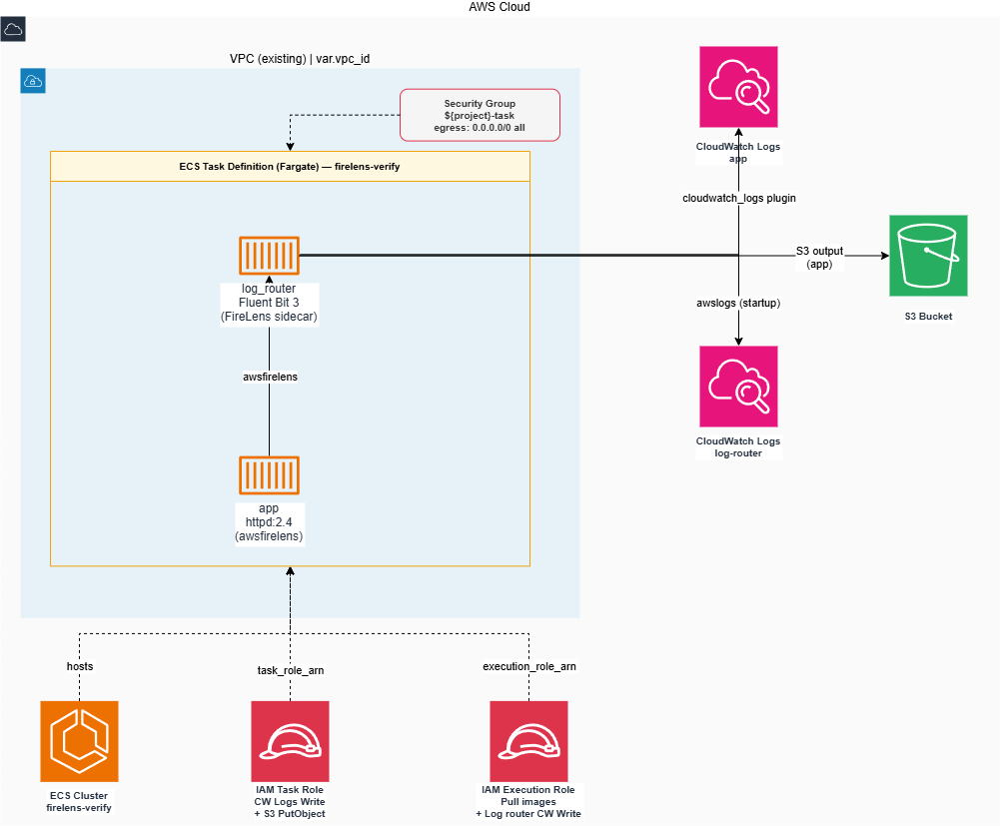

# aws-ecs-firelens-verify

## アーキテクチャ

構成図: 

### 構成概要

ECS Fargate タスク上で FireLens (Fluent Bit) サイドカーを使ったログルーティングを検証する PoC。

| コンテナ | イメージ | ログドライバ | ログ送信先 |
| --- | --- | --- | --- |
| `log_router` | ECR (`<project>-log-router:latest`) | `awslogs` | CloudWatch Logs (`/aws/ecs/.../log-router`) |
| `app` | `httpd:2.4` | `awsfirelens` | CloudWatch Logs (`/aws/ecs/.../app`) **+ S3** (`/logs/app/…`) |

`log_router` は `aws-for-fluent-bit:3` をベースにしたカスタムイメージをビルドして ECR に push して使用する。`enable_filesystem_buffer` トグルで構成が切り替わる。

- **memory バッファ（既定 / `:latest`）** — [docker/Dockerfile](docker/Dockerfile) をビルド。FireLens が自動生成するベース設定（CloudWatch OUTPUT）に [docker/extra.conf](docker/extra.conf) を `@INCLUDE` し、S3 OUTPUT を追加してマルチ宛先ルーティングを実現する。
- **filesystem バッファ（検証3 / `:fs`）** — [docker/Dockerfile.fs](docker/Dockerfile.fs) をビルド。`CMD` を上書きして [docker/fluent-bit-fs.conf](docker/fluent-bit-fs.conf)（`storage.type filesystem` の forward input を含むフル設定）を読み込ませる。

### 主なリソース

| カテゴリ | リソース |
| --- | --- |
| コンピュート | `aws_ecs_cluster` (firelens-verify)、`aws_ecs_task_definition` (Fargate, 2 コンテナ) |
| コンテナレジストリ | `aws_ecr_repository` (log_router カスタムイメージ) |
| セキュリティ | `aws_security_group` (task — ingress なし / egress all) |
| データストア | `aws_s3_bucket` (multi-dest 検証用ログバケット) + public access block |
| 監視 | `aws_cloudwatch_log_group` × 2 (app / log-router) |
| IAM | `aws_iam_role` × 2 (task-role / execution-role) + ポリシー |

---

## リソース作成手順

### 前提条件

- Terraform >= 1.10
- [aws-vault](https://github.com/99designs/aws-vault) がインストール済みで、使用する AWS プロファイルが登録済みであること
- デプロイ先の VPC が既存であること（本 Terraform は VPC を管理しない）

### 1. 変数ファイルの準備

```bash
cp terraform/terraform.tfvars.example terraform/terraform.tfvars
```

`terraform/terraform.tfvars` を編集して以下の変数を設定する。

| 変数名 | 型 | 説明 | サンプル値 |
| --- | --- | --- | --- |
| `aws_region` | `string` | デプロイ先 AWS リージョン | `"ap-northeast-1"` |
| `project_name` | `string` | リソース名・タグに使用するプロジェクト名 | `"firelens-verify"` |
| `vpc_id` | `string` | ECS タスクをデプロイする既存 VPC の ID | `"vpc-xxxxxxxxxxxxxxxxx"` |
| `s3_bucket_suffix` | `string` | S3 バケット名のグローバルユニークサフィックス（バケット名: `<project_name>-logs-<suffix>`） | `"REPLACE_ME"` |
| `app_log_retention_days` | `number` | app ログの CloudWatch Logs 保持日数 | `1` |
| `log_router_retention_days` | `number` | log_router (Fluent Bit) ログの CloudWatch Logs 保持日数 | `1` |
| `task_cpu` | `string` | ECS タスクの CPU ユニット数 | `"256"` |
| `task_memory` | `string` | ECS タスクのメモリ量 (MiB) | `"512"` |
| `log_router_memory_limit` | `number` | log_router コンテナのハードメモリ上限 (MiB)。超過時に OOMKill。`task_memory` 未満であること（既定 `200`） | （任意） |
| `app_log_driver_buffer_limit` | `number` | 検証2 用。awsfirelens ドライバが Fluent Bit へ渡す前に保持するログ行数（Docker→FB 間の `log-driver-buffer-limit`、AWS 既定 `1048576`）。検証2 では超過分が破棄されるよう小さめにする | `8192` |
| `enable_filesystem_buffer` | `bool` | 検証3 用トグル。`true` で log_router を filesystem バッファ構成（`:fs` イメージ + フル設定の CMD 上書き）に切り替える。既定 `false` は memory バッファ + `extra.conf` @INCLUDE 方式 | `false` |

### 2. 初期化

```bash
cd terraform
aws-vault exec <profile> -- terraform init
```

### 3. 実行計画の確認

```bash
aws-vault exec <profile> -- terraform plan
```

### 4. リソースの作成

```bash
aws-vault exec <profile> -- terraform apply
```

### 5. カスタム log_router イメージのビルドと push

`terraform apply` で ECR リポジトリが作成された後、カスタム Fluent Bit イメージをビルドして push する。

```bash
ECR_URL=$(aws-vault exec <profile> -- terraform output -raw ecr_repository_url)
REGION=$(aws-vault exec <profile> -- terraform output -raw aws_region 2>/dev/null || echo "ap-northeast-1")

# ECR 認証
aws-vault exec <profile> -- aws ecr get-login-password --region "$REGION" \
  | docker login --username AWS --password-stdin "$ECR_URL"

# ビルド & push（プロジェクトルートで実行）
docker build -t "$ECR_URL:latest" docker/
docker push "$ECR_URL:latest"
```

> イメージを push する前にタスクを実行した場合、ECS がイメージを pull できずに起動に失敗する。  
> 必ず push 後にタスクを実行すること。

**検証3（filesystem バッファ化）を実施する場合**は、`:fs` イメージも追加でビルド & push し、`enable_filesystem_buffer = true` で `terraform apply` する。詳細は [検証手順書](docs/verification.md) の検証3を参照。

```bash
docker build -t "$ECR_URL:fs" -f docker/Dockerfile.fs docker/
docker push "$ECR_URL:fs"
```

適用後、以下の出力値が表示される。

| 出力名 | 説明 |
| --- | --- |
| `ecs_cluster_name` | ECS クラスター名（`aws ecs run-task` / `update-service` で使用） |
| `ecs_cluster_arn` | ECS クラスター ARN |
| `task_definition_arn` | 最新のアクティブなタスク定義 ARN |
| `task_definition_family` | タスク定義ファミリー名 |
| `task_security_group_id` | タスク実行時の `--network-configuration` に指定するセキュリティグループ ID |
| `task_role_arn` | IAM タスクロール ARN |
| `execution_role_arn` | IAM 実行ロール ARN |
| `app_log_group_name` | app コンテナ出力用 CloudWatch Logs グループ名 |
| `log_router_log_group_name` | Fluent Bit (log_router) 自身のログ用 CloudWatch Logs グループ名 |
| `s3_bucket_name` | マルチ送信先ログルーティング検証用 S3 バケット名 |
| `task_policy_arn` | IAM タスクポリシー ARN |
| `vpc_id` | ECS タスクのネットワークに使用する VPC ID（サブネット ID 検索に使用） |
| `ecr_repository_url` | カスタム log_router イメージ用 ECR リポジトリ URL |

### 6. タスクの手動実行（検証時）

```bash
CLUSTER=$(aws-vault exec <profile> -- terraform output -raw ecs_cluster_name)
TASKDEF=$(aws-vault exec <profile> -- terraform output -raw task_definition_arn)
SG=$(aws-vault exec <profile> -- terraform output -raw task_security_group_id)

aws-vault exec <profile> -- aws ecs run-task \
  --cluster "$CLUSTER" \
  --task-definition "$TASKDEF" \
  --launch-type FARGATE \
  --network-configuration "awsvpcConfiguration={subnets=[<SUBNET_ID>],securityGroups=[$SG],assignPublicIp=ENABLED}"
```

> `<SUBNET_ID>` は `var.vpc_id` の VPC 内のサブネット ID に置き換えてください。

### 7. リソースの削除

```bash
aws-vault exec <profile> -- terraform destroy --auto-approve
```

---

## 検証手順

各シナリオの具体的な実行手順は [docs/verification.md](docs/verification.md) を参照。

| # | 検証内容 | 設定変更 |
| :-: | --- | --- |
| 1 | `ecs_*` メタデータ付与 / Fargate で `ec2_instance_id` なし | 不要（既定構成） |
| 2 | `mem buf overlimit` でログ欠落 | `app_log_driver_buffer_limit` を設定（例 `8192`）して `apply` |
| 3 | filesystem バッファ化でログ欠落が解消 | `enable_filesystem_buffer = true` + `:fs` イメージを push して `apply` |
| 4 | FireLens 標準 CloudWatch メトリクスは存在しない | 不要 |
