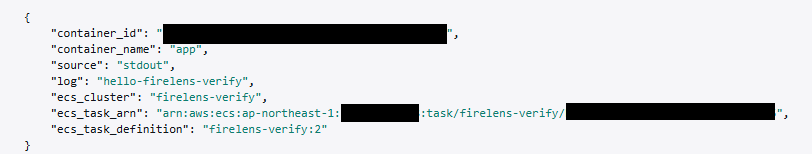
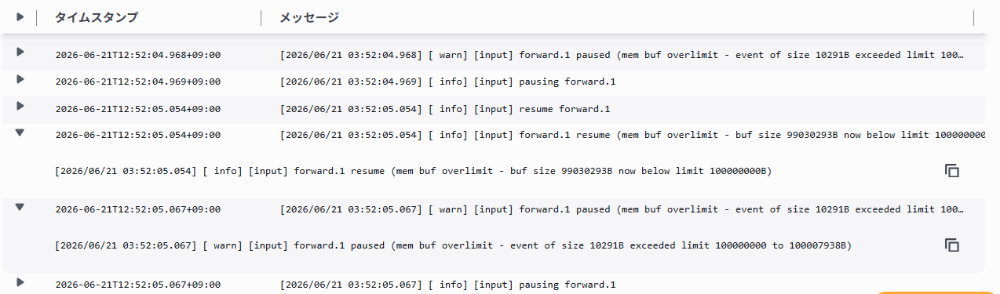
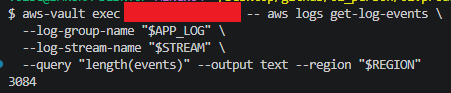
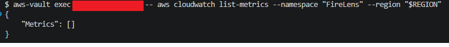
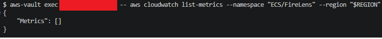
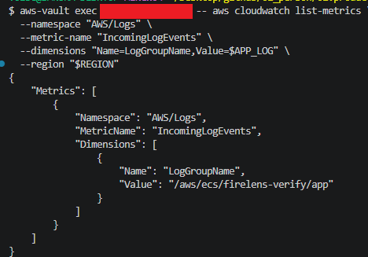

# 検証手順

ECS Fargate 上の FireLens (Fluent Bit) サイドカーのログバッファ挙動を実際に再現・観測するための手順書。  
[プロジェクト README](../README.md) を参照して `terraform apply` でリソースを作成してから実施する。

## 前提条件

- `terraform apply` 完了済み
- aws-vault インストール済み・プロファイル `<profile>` 設定(置換)済み
- AWS CLI インストール済み

> 以降のコマンドはすべて以下の形式で記述する。
> `aws-vault exec <profile> -- aws`
> `aws-vault exec <profile> -- terraform`

---

## 共通変数

プロジェクトルートで以下を実行する。`REGION` のみ手動設定し、残りは `terraform output` から取得する。

```bash
# terraform.tfvars の aws_region と合わせて設定
REGION=ap-northeast-1

# 以下は terraform output から取得
CLUSTER=$(aws-vault exec <profile> -- terraform output -raw ecs_cluster_name)
TASKDEF=$(aws-vault exec <profile> -- terraform output -raw task_definition_arn)
SG=$(aws-vault exec <profile> -- terraform output -raw task_security_group_id)
APP_LOG=$(aws-vault exec <profile> -- terraform output -raw app_log_group_name)
ROUTER_LOG=$(aws-vault exec <profile> -- terraform output -raw log_router_log_group_name)
S3_BUCKET=$(aws-vault exec <profile> -- terraform output -raw s3_bucket_name)
TASK_ROLE=$(aws-vault exec <profile> -- terraform output -raw task_role_arn | awk -F'/' '{print $NF}')
VPC=$(aws-vault exec <profile> -- terraform output -raw vpc_id)

# サブネット確認 — Public=True のサブネット ID を SUBNET に設定する
aws-vault exec <profile> -- aws ec2 describe-subnets \
  --filters "Name=vpc-id,Values=$VPC" \
  --query "Subnets[*].{ID:SubnetId,AZ:AvailabilityZone,Public:MapPublicIpOnLaunch}" \
  --output table --region "$REGION"

SUBNET=subnet-XXXX   # ↑ の出力から設定
```

---

## 検証モードの切り替え（terraform.tfvars）

検証1・2・4（memory バッファ）と検証3（filesystem バッファ）では log_router の構成が異なる。
構成は `terraform/terraform.tfvars` の **`enable_filesystem_buffer`** トグル 1 行で切り替える。
コード本体（`variables.tf` / `ecs.tf`）は編集しない。

| 検証 | `enable_filesystem_buffer` | log_router 構成 |
| --- | --- | --- |
| 検証1・2・4 | `false`（既定） | memory バッファ + `extra.conf` を `@INCLUDE`（`:latest` イメージ） |
| 検証3 | `true` | filesystem バッファ + フル設定を CMD で読み込み（`:fs` イメージ） |

> **注（検証2・3 共通）**: 欠落を再現するため、`terraform.tfvars` で **`app_log_driver_buffer_limit`** を設定しておく（例: `8192`）。これは Docker→Fluent Bit 間のバッファ行数で、`enable_filesystem_buffer` とは独立に効く。検証2・3 とも同じ値で実行し、差は `enable_filesystem_buffer` のみにする。値の決め方の詳細は[検証2の手順](#手順検証2)を参照。

### 切り替え手順

```bash
# 1. terraform.tfvars の該当行を編集する
#    検証1・2・4 を実施する場合: enable_filesystem_buffer = false
#    検証3 を実施する場合      : enable_filesystem_buffer = true

# 2. 変更を反映（タスク定義が選択した構成で再登録される）
aws-vault exec <profile> -- terraform apply

# 3. 共通変数 TASKDEF を取り直す（apply でリビジョンが変わるため）
TASKDEF=$(aws-vault exec <profile> -- terraform output -raw task_definition_arn)
```

> **注**: 検証3（`true`）を実施する前に、`:fs` タグのイメージを ECR に push しておくこと（[検証3の事前準備](#検証3filesystem-バッファ化でログ欠落が解消する)を参照）。push 前に `apply` すると `:fs` イメージが存在せずタスク起動に失敗する。

---

## 検証1｜ecs_* メタデータ付与 / Fargate で ec2_instance_id なし

**仮説**: FireLens は既定で各レコードに `ecs_cluster` / `ecs_task_arn` / `ecs_task_definition` を付与する。Fargate では `ec2_instance_id` は付かない。

### 手順（検証1）

```bash
# タスク起動（stdout に 1 行出して 30 秒待つ）
aws-vault exec <profile> -- aws ecs run-task \
  --cluster "$CLUSTER" \
  --task-definition "$TASKDEF" \
  --launch-type FARGATE \
  --region "$REGION" \
  --network-configuration "awsvpcConfiguration={subnets=[$SUBNET],securityGroups=[$SG],assignPublicIp=ENABLED}" \
  --overrides '{"containerOverrides":[{"name":"app","command":["sh","-c","echo hello-firelens-verify && sleep 30"]}]}'

# ログ確認（起動から 30〜60 秒後）
aws-vault exec <profile> -- aws logs tail "$APP_LOG" --follow --region "$REGION"
```

### 確認ポイント（検証1）

届いたログイベントの JSON に以下が含まれること:

| フィールド | 期待値 |
| --- | --- |
| `ecs_cluster` | クラスター名 |
| `ecs_task_arn` | タスク ARN |
| `ecs_task_definition` | タスク定義ファミリー:リビジョン |
| `ec2_instance_id` | **含まれない**（Fargate のため） |

#### 結果（検証1）



---

## 検証2｜mem buf overlimit でログ欠落

**仮説**: 既定（`storage.type memory` のメモリバッファ）で大量ログを高速に流すと、Fluent Bit の forward input がメモリバッファ上限に達して pause され、さらに Docker→Fluent Bit 間のドライババッファ（`log-driver-buffer-limit`）が溢れるとドライバがメッセージを破棄するため、ログが欠落する。OOMKill はバックプレッシャーにより発生しない。

### 手順（検証2）

> **前提**: `terraform.tfvars` で **`app_log_driver_buffer_limit`** を設定して `apply` 済みであること。値の取り方が肝心で、欠落点が直列2段（`app → Docker バッファ(行数) → FB forward input(メモリバッファ)`）あるため、次の **2条件を両方**満たす必要がある:
>
> 1. **`overlimit` を出す**: `app_log_driver_buffer_limit` を **FB forward input のメモリバッファ容量（行数換算）より大きく**する（実測では `8192` で再現）。小さすぎると Docker 段で先に破棄され、FB の forward input がメモリ上限に達せず `mem buf overlimit` が出ない。
> 2. **欠落を出す**: 投入量 `N`×10KB を **FB のメモリバッファ容量と Docker バッファ（`app_log_driver_buffer_limit × 10KB`）の合計より十分大きく**する。FB が pause している間に Docker バッファが溢れて破棄される。

```bash
export MSYS_NO_PATHCONV=1       # Windows Git Bashの場合のみ必要
export MSYS2_ARG_CONV_EXCL="*"  # Windows Git Bashの場合のみ必要

# 計測開始時刻を UTC で控える（後段の get-metric-statistics の --start-time に使う）
START=$(date -u +%Y-%m-%dT%H:%M:%SZ)

# 投入行数。欠落には N×10KB が (FBメモリバッファ容量 + app_log_driver_buffer_limit×10KB) を十分超える必要がある（前提の注参照）。
# 欠落幅が小さければ増やす。検証3 と必ず同じ値にする。
N=100000

# N 行（各 約10KB）を高速出力して app を終了させる。
# while の無限ループではなく seq で固定数にすることで、検証3と総出力量を揃えて比較できる。
aws-vault exec <profile> -- aws ecs run-task \
  --cluster "$CLUSTER" \
  --task-definition "$TASKDEF" \
  --launch-type FARGATE \
  --region "$REGION" \
  --network-configuration "awsvpcConfiguration={subnets=[$SUBNET],securityGroups=[$SG],assignPublicIp=ENABLED}" \
  --overrides '{"containerOverrides":[{"name":"app","command":["sh","-c","P=$(printf %10000s | tr \" \" X); for i in $(seq 1 '"$N"'); do echo \"$P\"; done"]}]}' \
  --query "tasks[0].taskArn" --output text

# log_router のログで paused を観察（タスク実行中）。
# ※ 固定 N 行はバーストが短く、ライブ tail だと pause のウィンドウを取りこぼすことがある。
#   その場合はラン完了後に下の filter-log-events で時間窓検索すると確実（START を起点に件数を数える）。
aws-vault exec <profile> -- aws logs tail "$ROUTER_LOG" --follow --region "$REGION" | grep -i "paused\|overlimit"

# （取りこぼした場合の確実な確認）ラン後に overlimit 出力件数を数える
aws-vault exec <profile> -- aws logs filter-log-events \
  --log-group-name "$ROUTER_LOG" \
  --start-time $(( $(date -u -d "$START" +%s) * 1000 )) \
  --filter-pattern "overlimit" \
  --query "length(events)" --output text --region "$REGION"

# タスク完了の数分後（flush 完了を待ってから）、到達総数を IncomingLogEvents の Sum で数える。
#   - get-log-events は 1 ページ最大 1MB / 10,000 件で打ち切られ、約10KB/行では ~100 件しか返らないため使わない。
#   - IncomingLogEvents はロググループ配下の全ストリームの到達数を集計するので、欠落の有無を正しく観測できる。
END=$(date -u +%Y-%m-%dT%H:%M:%SZ)

aws-vault exec <profile> -- aws cloudwatch get-metric-statistics \
  --namespace AWS/Logs \
  --metric-name IncomingLogEvents \
  --dimensions Name=LogGroupName,Value="$APP_LOG" \
  --start-time "$START" --end-time "$END" \
  --period 3600 --statistics Sum \
  --query "Datapoints[].Sum" --output text --region "$REGION"
# ↑ Datapoints が複数（時間窓が時刻境界をまたいだ場合）出たら、その合計が到達総数。
```

### 確認ポイント（検証2）

> **背景**:  
> ログは app の stdout →**Docker ログドライバ（awsfirelens）のバッファ**→**Fluent Bit の forward input（`storage.type memory` の既定メモリバッファ）**→ CloudWatch と流れる。欠落点は次の 2 か所:
>
> 1. **Fluent Bit forward input** — メモリバッファが上限に達すると input が pause され、pause 中の新規レコードは失われる（[AWS: メモリバッファリング（既定）](https://docs.aws.amazon.com/AmazonECS/latest/developerguide/firelens-docker-buffer-limit.html)）。  
> 2. **Docker ドライバのバッファ** — `log-driver-buffer-limit`（**既定 1,048,576 行**）が溢れると Docker が古いメッセージを破棄する（[AWS: Docker バッファ制限の設定](https://docs.aws.amazon.com/AmazonECS/latest/developerguide/firelens-docker-buffer-limit.html)）。awsfirelens は実質ノンブロッキング（溢れたら破棄）で、ブロッキングではない。  
> いずれの破棄も OOMKill は起こさない（バックプレッシャーで抑制される）。

- `ROUTER_LOG` に `[input] forward.1 paused (mem buf overlimit)` が出る
- OOMKill は発生しない
- 到達行数 < `N`（投入行数。欠落あり）。到達数は `AWS/Logs` `IncomingLogEvents` の Sum で計測する（`get-log-events` の `length(events)` は 1 ページ上限で打ち切られ正確に数えられない）

#### 結果（検証2）

| 確認項目 | 期待 | 実測 |
| --- | --- | --- |
| `ROUTER_LOG` の出力 | pause/resume の繰り返し | `mem buf overlimit` → pause/resume サイクルが確認された |
| OOMKill | 発生しない | **発生しない** |
| 到達行数 | < `N`（欠落あり） | 90,550 < 100,000 |

**結論**: `storage.type memory` 既定のメモリバッファが上限に達して input が pause（バックプレッシャー）し OOMKill は抑制されるが、pause 中の新規レコードおよび Docker ドライババッファ（`log-driver-buffer-limit`）の溢れ分は破棄されるため、ログが欠落する。




---

## 検証3｜filesystem バッファ化でログ欠落が解消する

**仮説**: forward input を `storage.type filesystem` に切り替えると、検証2と同じ負荷でも `mem buf overlimit` による pause／ドロップが起きず、到達行数が投入数 `N` に近づく。

> **重要（前提）**:
> filesystem バッファは **input 定義に `storage.type filesystem` を書く**必要があるが、FireLens が自動生成する forward input には後付けできない（[公式: カスタム設定で forward input を定義してはいけない](https://docs.aws.amazon.com/AmazonECS/latest/developerguide/firelens-taskdef.html)）。
> そのため検証3だけは、検証1・2・4 で使う **`extra.conf` を `@INCLUDE` する方式ではなく、フル設定で丸ごと置き換える方式**を使う。具体的にはログルーターの `CMD` を上書きして自前のフル設定を読ませ、その中で forward input を再定義する（[oomkill-prevention の workaround](https://github.com/aws-samples/amazon-ecs-firelens-examples/tree/mainline/examples/fluent-bit/oomkill-prevention)）。

### 事前準備（検証3のみ・インフラ変更あり）

検証1・2・4 は同梱の `extra.conf`（@INCLUDE 方式）で動くが、検証3は別構成のイメージが要る。

**1. フル設定 `docker/fluent-bit-fs.conf` を用意**（forward input を filesystem 化し、OUTPUT も自前定義する。生成設定をバイパスするため app 側 `logConfiguration.options` は無効になる）:

```ini
[SERVICE]
    Flush                    1
    Grace                    120
    storage.path             /var/log/flb-storage/
    storage.max_chunks_up    32
    storage.backlog.flush_on_shutdown On

[INPUT]
    Name         forward
    unix_path    /var/run/fluent.sock
    threaded     true
    storage.type filesystem

[OUTPUT]
    Name                     cloudwatch_logs
    Match                    *
    region                   ${AWS_REGION}
    log_group_name           ${APP_LOG_GROUP}
    log_stream_prefix        app-
    auto_create_group        false
    workers                  2
    retry_limit              15
    storage.total_limit_size 10G
```

**2. CMD を上書きする Dockerfile**（FireLens 生成設定をバイパスして上記を読ませる）:

```dockerfile
FROM public.ecr.aws/aws-observability/aws-for-fluent-bit:3
COPY fluent-bit-fs.conf /fluent-bit/alt/fluent-bit.conf
CMD ["/fluent-bit/bin/fluent-bit", "-c", "/fluent-bit/alt/fluent-bit.conf"]
```

**3. `:fs` タグでビルド & push**:

```bash
ECR_URL=$(aws-vault exec <profile> -- terraform output -raw ecr_repository_url)

aws-vault exec <profile> -- aws ecr get-login-password --region "$REGION" \
  | docker login --username AWS --password-stdin "$ECR_URL"

docker build -t "$ECR_URL:fs" -f docker/Dockerfile.fs docker/
docker push "$ECR_URL:fs"
```

**4. 検証3モードへ切り替えて `apply`**: `terraform.tfvars` の `enable_filesystem_buffer = true` にして `terraform apply` する（[検証モードの切り替え](#検証モードの切り替えterraformtfvars)を参照）。これにより log_router の `image` が `:fs` に、`environment` に `APP_LOG_GROUP` が自動で設定される（`config-file-value` は CMD 上書きにより無視されるため空になる）。`apply` 後は `TASKDEF` を取り直す。

> **注**: filesystem バッファはタスクのエフェメラルストレージ（Fargate 既定 20 GB）を使う。`storage.total_limit_size` の合計がこれを超えないこと。

### 手順（検証3）

検証2と**同一の負荷**を流して比較する（before = 検証2 / after = 検証3）。

> 事前に `enable_filesystem_buffer = true` で `apply` し、`TASKDEF` を取り直しておくこと（[検証モードの切り替え](#検証モードの切り替えterraformtfvars)を参照）。`$TASKDEF` がそのまま filesystem 構成のタスク定義を指す。

```bash
# TASKDEFの再定義
TASKDEF=$(aws-vault exec sandbox@personal -- terraform output -raw task_definition_arn)

# 計測開始時刻を UTC で控える（検証2と同じ計数手順）
START=$(date -u +%Y-%m-%dT%H:%M:%SZ)

# 検証2と同じ N にする（必ず一致させること）。
N=100000

# 検証2と同じ負荷（N 行）を投入。TASKDEF は :fs 構成に切り替え済み。
aws-vault exec <profile> -- aws ecs run-task \
  --cluster "$CLUSTER" \
  --task-definition "$TASKDEF" \
  --launch-type FARGATE \
  --region "$REGION" \
  --network-configuration "awsvpcConfiguration={subnets=[$SUBNET],securityGroups=[$SG],assignPublicIp=ENABLED}" \
  --overrides '{"containerOverrides":[{"name":"app","command":["sh","-c","P=$(printf %10000s | tr \" \" X); for i in $(seq 1 '"$N"'); do echo \"$P\"; done"]}]}' \
  --query "tasks[0].taskArn" --output text

# log_router に overlimit が出ないことを確認（タスク実行中）
aws-vault exec <profile> -- aws logs tail "$ROUTER_LOG" --follow --region "$REGION" | grep -i "paused\|overlimit"

# タスク完了の数分後、到達総数を IncomingLogEvents の Sum で数える（検証2と同じ手順）。
# filesystem バッファはシャットダウン時の flush_on_shutdown + Grace 120 でディスク backlog を吐き切るため、
# タスク停止直後ではなく flush 完了まで待ってから計測すること。
END=$(date -u +%Y-%m-%dT%H:%M:%SZ)

aws-vault exec <profile> -- aws cloudwatch get-metric-statistics \
  --namespace AWS/Logs \
  --metric-name IncomingLogEvents \
  --dimensions Name=LogGroupName,Value="$APP_LOG" \
  --start-time "$START" --end-time "$END" \
  --period 3600 --statistics Sum \
  --query "Datapoints[].Sum" --output text --region "$REGION"
# ↑ Datapoints が複数出たら合計が到達総数。検証2の値と比較する。
```

### 確認ポイント（検証3）

- `ROUTER_LOG` に `mem buf overlimit` / `paused` が **出ない**
- 到達行数（`IncomingLogEvents` の Sum）≈ `N`（検証2より明確に増える）
- ディスク（`storage.path`）にチャンクが滞留し、Fluent Bit 再起動後も残る

#### 結果（検証3）

| 確認項目 | 検証2（memory・before） | 検証3（filesystem・after） |
| --- | --- | --- |
| `mem buf overlimit` | 発生（pause/resume） | 発生無し |
| 到達行数 | 90,550 | 100,000 |

**結論**: 仮説どおり、forward input を `storage.type filesystem` に切り替えることでログ欠落は解消した。検証2（memory バッファ）では同一負荷 `N=100,000` 行に対し到達は 90,550 行にとどまり `mem buf overlimit` による pause/resume と約 9,450 行（≒9.5%）の欠落が発生したが、検証3（filesystem バッファ）では `overlimit` が一切発生せず到達行数が `N` と完全に一致（100,000 行）した。




---

## 検証4｜FireLens 標準 CloudWatch メトリクスは存在しない

**仮説**: FireLens / Fluent Bit 専用の CloudWatch メトリクスは AWS 標準では提供されない。観測はログルーター自身のログと宛先側メトリクスに依存する。

> **背景**:  
> ここで「メトリクスが存在しない」とは、Fluent Bit の**内部動作に関するメトリクス**が CloudWatch の専用ネームスペースとして公開されていないことを指す。  
> 具体的には以下のようなメトリクスが**存在しない**:
>
> | 存在しないメトリクス例 | 意味 |
> | --- | --- |
> | バッファ使用率 | 現在バッファが何 MB 使われているか |
> | ドロップレコード数 | バックプレッシャーで捨てられたログ行数 |
> | リトライ回数 | 宛先への再送試行数 |
>
> **Container Insights との違い**:  
> Container Insights はコンテナの CPU・メモリ・ネットワークといった**インフラ層のメトリクス**を収集するが、FireLens が「ログを正常に転送できているか」（バッファが詰まっているか、ドロップが発生しているか）は観測できない。

### 手順（検証4）

```bash
# FireLens 専用ネームスペースを検索（存在しないことを確認）
aws-vault exec <profile> -- aws cloudwatch list-metrics --namespace "FireLens" --region "$REGION"
aws-vault exec <profile> -- aws cloudwatch list-metrics --namespace "ECS/FireLens" --region "$REGION"

# 代替観測: CloudWatch Logs 宛先側メトリクス
aws-vault exec <profile> -- aws cloudwatch list-metrics \
  --namespace "AWS/Logs" \
  --metric-name "IncomingLogEvents" \
  --dimensions "Name=LogGroupName,Value=$APP_LOG" \
  --region "$REGION"
```

### 確認ポイント（検証4）

- `FireLens` / `ECS/FireLens` ネームスペースが空（メトリクスなし）
- 観測手段が `ROUTER_LOG` のログ＋宛先側メトリクス（`AWS/Logs` `IncomingLogEvents` 等）のみであることを確認

**FireLens の健全性を間接的に把握するための代替手段**:

| 観測手段 | 何がわかるか | 限界 |
| --- | --- | --- |
| `ROUTER_LOG` のログ | `mem buf overlimit` / `paused` などの警告でバッファ詰まりを検知 | ログ量が多いと警告が埋もれる |
| `AWS/Logs` `IncomingLogEvents` | CloudWatch への到達ログ数が急減したら転送停止を推測できる | 減少の原因が FireLens か宛先かの切り分けが必要 |

#### 結果（検証4）





---

## 検証後の Teardown

```bash
# 1. 実行中タスクがないことを確認
aws-vault exec <profile> -- aws ecs list-tasks --cluster "$CLUSTER" --region "$REGION"

# 2. Terraform で全リソース破棄
aws-vault exec <profile> -- terraform destroy
```
